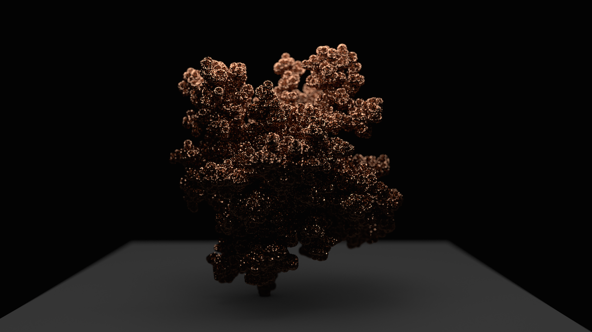
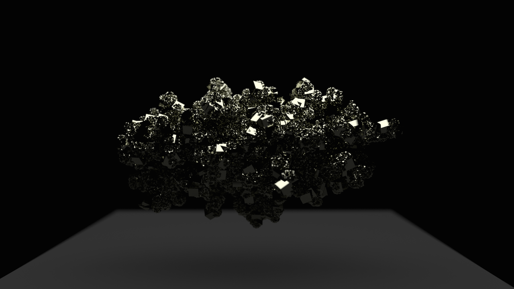

# Diffusion Limited Aggregation on the GPU

This is a fast implementation of the [Diffusion Limited Aggregation](https://en.wikipedia.org/wiki/Diffusion-limited_aggregation) algorithm in CUDA/Thrust. It was created with the aim to procedurally generate high-resolution coral-like structures, such as this:

Or crystal-like structures, such as this:

The documentation for this project is currently a work in progress. If you are interested in any aspect of the code, please let me know.
